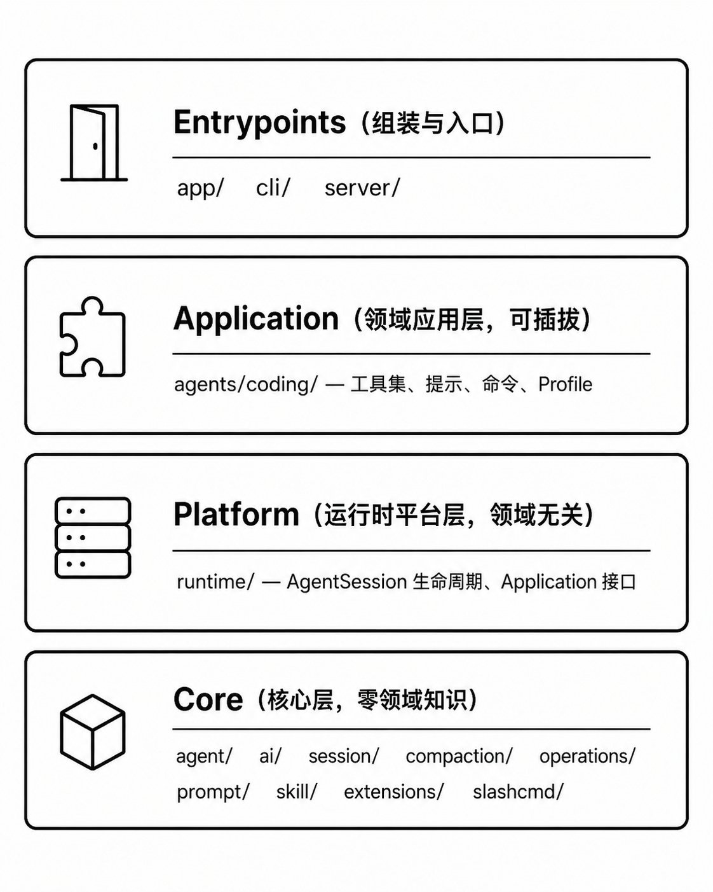

# Pi-Go

用 Go 实现的通用 Agent 框架，核心目标：**可扩展的 Agent 底座 + 可插拔的应用层**。当前主要应用是 coding-agent（代码编辑助手）。

## 架构



```
┌─────────────────────────────────────────────────────┐
│  Entrypoints（组装与入口）                           │
│  app/  cli/  server/                                 │
├─────────────────────────────────────────────────────┤
│  Application（领域应用层，可插拔）                    │
│  agents/coding/ — 工具集、提示、命令、Profile        │
├─────────────────────────────────────────────────────┤
│  Platform（运行时平台层，领域无关）                   │
│  runtime/ — AgentSession 生命周期、Application 接口  │
├─────────────────────────────────────────────────────┤
│  Core（核心层，零领域知识）                           │
│  agent/  ai/  session/  compaction/  operations/     │
│  prompt/  skill/  extensions/  slashcmd/             │
└─────────────────────────────────────────────────────┘
```

**层间依赖规则**：Core 不依赖上层；Platform 只依赖 Core；Application 通过 `runtime.Application` 接口与 Platform 解耦；Entrypoints 组装所有依赖。

## 功能

- **多 Provider 支持**：Anthropic、OpenAI、DeepV、Mock，通过插件注册机制扩展
- **流式输出**：SSE 事件流，支持 text delta / tool call / error 等细粒度事件
- **Agent 循环**：双层循环（外层 follow-up + 内层 tool call），支持顺序/并行工具执行
- **7 个内置工具**：bash、read、write、edit、grep、find、ls
- **会话持久化**：JSONL append-only 存储，支持树状分支
- **上下文压缩**：长对话自动摘要，防止超出上下文窗口
- **技能系统**：加载 `.claude/skills/` 目录下的 SKILL.md
- **HTTP API**：RESTful 接口 + SSE 流式端点 + WebSocket，含 logging/recovery/CORS 中间件
- **CLI 控制面**：Slash Commands 框架 + 14 个内置命令
- **Profile 系统**：coding / review 双 profile，切换即重建 agent
- **SSH 远程执行**：通过 Operations 抽象切换本地 / SSH 执行后端
- **扩展系统**：Extension 接口支持工具、命令、事件钩子注入
- **Tool Lifecycle Hooks**：Before/After hook + PrepareArguments 接口
- **飞书桥接**：独立服务（`cmd/pi-feishu-bridge`），将 Agent 接入飞书群聊

## 快速开始

### 安装

```bash
go build -o pi-agent ./cmd/pi-agent
```

### 配置

复制 `.env.example` 为 `.env`，填入 API Key：

```bash
cp .env.example .env
# 编辑 .env，设置 PI_GO_PROVIDER 和对应的 API Key
```

### 运行

```bash
# 单次运行
./pi-agent -mode run -prompt "hello"

# 交互式聊天
./pi-agent -mode chat

# HTTP 服务
./pi-agent -mode serve -listen 127.0.0.1:8080
```

### 桌面端

pi-go 提供了基于 Electron + React 的桌面客户端：

```bash
cd desktop

# 安装依赖
npm install

# 开发模式（Vite + Electron 热重载）
npm run electron:dev

# 构建桌面应用
npm run electron:build

# 指定架构构建
npm run electron:build:arm64
npm run electron:build:x64
```

### 指定会话

```bash
./pi-agent -mode chat -session sess_1234567890
```

## HTTP API

| 方法 | 路径 | 说明 |
|------|------|------|
| `GET` | `/health` | 健康检查 |
| `POST` | `/chat` | 同步对话 |
| `POST` | `/chat/stream` | SSE 流式对话 |
| `GET` | `/sessions` | 列出会话 |
| `POST` | `/sessions` | 创建会话 |
| `GET` | `/sessions/{id}/messages` | 获取会话消息 |
| `GET` | `/sessions/{id}/info` | 获取会话信息 |
| `DELETE` | `/sessions/{id}` | 删除会话 |
| `POST` | `/sessions/{id}/model` | 切换会话模型 |
| `POST` | `/sessions/{id}/compact` | 压缩会话上下文 |
| `POST` | `/sessions/{id}/command` | 执行斜杠命令 |
| `GET` | `/models` | 列出可用模型 |
| `GET` | `/tools` | 列出工具 |
| `GET` | `/ws` | WebSocket 连接 |

## 环境变量

| 变量 | 默认值 | 说明 |
|------|--------|------|
| `PI_GO_PROVIDER` | `mock` | LLM Provider：`mock` / `anthropic` / `openai` / `deepv` |
| `ANTHROPIC_API_KEY` | - | Anthropic API Key |
| `ANTHROPIC_MODEL` | - | Anthropic 模型名称 |
| `ANTHROPIC_BASE_URL` | `https://api.anthropic.com` | Anthropic API 地址 |
| `OPENAI_API_KEY` | - | OpenAI API Key |
| `OPENAI_MODEL` | - | OpenAI 模型名称 |
| `OPENAI_BASE_URL` | `https://api.openai.com/v1` | OpenAI API 地址 |
| `DEEPV_ENABLED` | `false` | 启用 DeepV Provider |
| `DEEPV_SERVER_URL` | - | DeepV 服务器地址 |
| `DEEPV_MODEL` | - | DeepV 模型名称 |
| `DEEPV_WORK_DIR` | 当前目录 | DeepV 工作目录 |
| `PI_GO_HOST` | `127.0.0.1` | HTTP 监听地址 |
| `PI_GO_PORT` | `8080` | HTTP 监听端口 |
| `PI_GO_DATA_DIR` | `./data` | 数据目录 |
| `PI_GO_SESSION_FILE` | `./data/session.jsonl` | 会话文件路径 |
| `PI_GO_ENABLE_BASH` | `false` | 是否启用 Bash 工具 |
| `PI_GO_BASH_TIMEOUT_SECONDS` | `30` | Bash 命令超时 |
| `PI_GO_MAX_OUTPUT_LEN` | `30000` | 工具输出最大字符数 |
| `PI_GO_WORKSPACE` | 当前目录 | 工作目录 |
| `PI_GO_EXECUTION_MODE` | `local` | 执行后端：`local` 或 `ssh` |
| `PI_GO_SSH_HOST` | - | SSH 模式目标主机 |
| `PI_GO_SSH_PORT` | `22` | SSH 端口 |
| `PI_GO_SSH_WORKDIR` | - | SSH 模式远程工作目录 |
| `PI_GO_ALLOWED_TOOLS` | - | 工具白名单（逗号分隔） |
| `PI_GO_BLOCKED_TOOLS` | - | 工具黑名单（逗号分隔） |
| `PI_GO_HISTORY_FILE` | - | 交互模式历史记录路径 |
| `PI_GO_PROMPT_TEMPLATE` | - | 自定义提示模板路径 |

完整环境变量说明见 [CONTRIBUTING.md](docs/CONTRIBUTING.md#八环境变量速查)。

## 参与贡献

详见 [贡献指南](docs/CONTRIBUTING.md)，包含项目结构、开发流程、代码规范等。

## 测试

```bash
go test ./...
```

## 项目统计

- **语言**：Go 1.22+
- **代码量**：~12,400 行（74 个源文件 + 39 个测试文件）
- **内置工具**：7 个（read / write / edit / bash / grep / find / ls）
- **斜杠命令**：14 个（help / new / switch / sessions / session / model / models / tools / profiles / profile / compact / branch / goal / context / clear）
