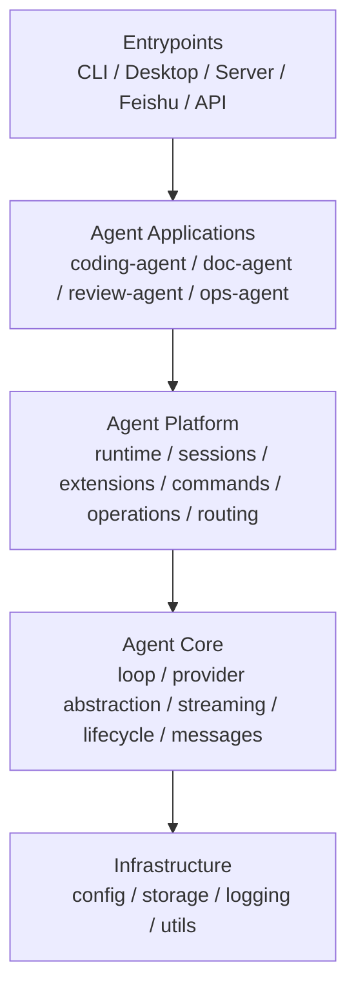

# Pi-Go 分层重构建议

> 目标：为 `pi-go` 建立一套既支持当前 `coding-agent`，又能承接未来多种 agent 的分层结构。  
> 本文档重点回答两个问题：
> 1. `pi-go` 应该如何做纵向分层
> 2. `coding-agent` 将来如何与其他 agent 并列存在

## 1. 核心结论

`pi-go` 后续不应该继续围绕单一 `coding-agent` 纵向长大，而应该演进成：

- 一个通用的 **agent core**
- 一个可复用的 **agent platform**
- 多个并列的 **agent applications**
- 多种面向用户的 **entrypoints**

也就是说，未来结构不应是：

```text
pi-go = coding-agent
其他 agent 挂在 coding-agent 下面
```

而应是：

```text
pi-go = agent platform
  ├─ coding-agent
  ├─ future doc-agent
  ├─ future review-agent
  ├─ future ops-agent
  └─ ...
```

## 2. 推荐总分层



## 3. 四层定义

## 3.1 Agent Core

这层回答的问题是：

**“一个通用 agent 是怎么运行起来的？”**

应承载：

- provider 抽象
- message / content block 模型
- stream event
- tool execution loop
- lifecycle hook 执行
- compaction 基础机制

特点：

- 不带 `coding` 语义
- 不关心 SSH、repo、飞书、桌面端
- 其他 agent 也能直接复用

在当前仓库里，大致对应：

- [internal/agent](/Users/weijian/Desktop/develop/test/pi/pi-go/internal/agent)
- [internal/ai](/Users/weijian/Desktop/develop/test/pi/pi-go/internal/ai)
- [internal/compaction](/Users/weijian/Desktop/develop/test/pi/pi-go/internal/compaction)

说明：

- `agent core` 的目标应尽量保持通用
- 当前较明显的 `coding-agent` 语义泄露，不主要在 `internal/agent/` 主体，而在：
  - [internal/ai/providers/deepv.go](/Users/weijian/Desktop/develop/test/pi/pi-go/internal/ai/providers/deepv.go) 的 Git remote / fake remote 逻辑
  - [internal/prompt](/Users/weijian/Desktop/develop/test/pi/pi-go/internal/prompt) 的部分运行时与 coding 指南内容

这属于后续值得逐步清理的技术债。

## 3.2 Agent Platform

这层回答的问题是：

**“多个不同 agent 应用如何共享运行时基础设施？”**

应承载：

- `AgentSession`
- session registry
- session persistence / indexing
- app assembly
- extensions registry
- slash command framework
- operations abstraction
- model registry
- server session routing
- prompt assembly framework

特点：

- 比 core 更接近产品，但仍然不应写死为 `coding-agent`
- 应服务于多个 agent applications

在当前仓库里，大致对应：

- [internal/runtime](/Users/weijian/Desktop/develop/test/pi/pi-go/internal/runtime)
- [internal/app](/Users/weijian/Desktop/develop/test/pi/pi-go/internal/app)
- [internal/session](/Users/weijian/Desktop/develop/test/pi/pi-go/internal/session)
- [internal/sessionmgr](/Users/weijian/Desktop/develop/test/pi/pi-go/internal/sessionmgr)
- [internal/extensions](/Users/weijian/Desktop/develop/test/pi/pi-go/internal/extensions)
- [internal/slashcmd](/Users/weijian/Desktop/develop/test/pi/pi-go/internal/slashcmd)
- [internal/server](/Users/weijian/Desktop/develop/test/pi/pi-go/internal/server)
- [internal/operations](/Users/weijian/Desktop/develop/test/pi/pi-go/internal/operations)
- [internal/skill](/Users/weijian/Desktop/develop/test/pi/pi-go/internal/skill)
- [internal/prompt](/Users/weijian/Desktop/develop/test/pi/pi-go/internal/prompt) 的框架部分

补充说明：

- `operations` 的“执行后端切换抽象”本身偏 Platform
- 但当前 `operations` 的具体能力集合主要是：
  - `BashOperations`
  - `FileOperations`

这两类能力明显更接近 `coding-agent` 当前需求，而不是所有 future agent 的通用必需品。

所以更准确的判断是：

- `operations` 抽象思想属于 Platform
- 当前 `operations` 的具体能力边界仍然带有明显 `coding-agent` 色彩

## 3.3 Agent Applications

这层回答的问题是：

**“这个 agent 到底做什么？”**

这里的每个 agent 应该是并列关系，例如：

- `coding-agent`
- `doc-agent`
- `review-agent`
- `ops-agent`
- `feishu-chat-agent`

`coding-agent` 在这里只是其中一个，而不是平台本身。

它应承载：

- coding-specific tools 组合
- coding-specific prompt 规则
- coding slash commands
- coding workflows
- repo-aware behavior
- SSH/remote workspace 语义

当前仓库里，这层还没有被明确收出来，主要散在：

- [internal/tools](/Users/weijian/Desktop/develop/test/pi/pi-go/internal/tools)
- [internal/prompt](/Users/weijian/Desktop/develop/test/pi/pi-go/internal/prompt) 的 application-specific 内容
- [internal/slashcmd](/Users/weijian/Desktop/develop/test/pi/pi-go/internal/slashcmd) 的部分命令
- [internal/mode](/Users/weijian/Desktop/develop/test/pi/pi-go/internal/mode) 的部分 CLI 交互语义

## 3.4 Entrypoints

这层回答的问题是：

**“用户通过什么入口接触这些 agent？”**

包括：

- CLI
- Desktop
- HTTP API
- Feishu bridge

特点：

- 不承载太多 agent 业务逻辑
- 更偏交互面和接入面

当前仓库里，大致对应：

- [cmd/pi-agent/main.go](/Users/weijian/Desktop/develop/test/pi/pi-go/cmd/pi-agent/main.go)
- [desktop](/Users/weijian/Desktop/develop/test/pi/pi-go/desktop)
- [internal/mode](/Users/weijian/Desktop/develop/test/pi/pi-go/internal/mode)
- 未来的 `cmd/pi-feishu-bridge`

## 4. 当前代码的推荐映射

## 4.1 现在就可以视为 Core 的

- `internal/agent`
- `internal/ai`
- `internal/compaction`

这些包后续应尽量保持通用，不再继续吸收 `coding-agent` 特有逻辑。

## 4.2 现在就可以视为 Platform 的

- `internal/runtime`
- `internal/app`
- `internal/session`
- `internal/sessionmgr`
- `internal/extensions`
- `internal/slashcmd`
- `internal/server`
- `internal/operations`
- `internal/skill`

以及：

- `internal/prompt` 的框架性部分

其中有些包目前仍混入了应用层语义，但概念上已经更接近平台层。

## 4.3 目前最该逐步抽成 Application 的

- `internal/tools`
- `slashcmd` 中 coding-specific 命令
- `prompt` 中 coding-specific 规则
- `interactive` 中 coding-specific 展示语义
- `internal/ai/providers/deepv.go` 中明显依赖 Git / repo 语义的部分

建议未来逐步收成：

```text
internal/agents/
  coding/
    tools/
    prompt/
    commands/
    policy/
```

## 4.4 Entry points 保持轻

建议继续保持：

- `cmd/pi-agent/main.go` 只做装配和分发
- `mode/interactive.go` 只做 CLI 呈现
- `server` 只做协议和 session 路由
- `desktop` 只做 UI 工作台

## 5. 最值得尽快明确的边界

## 5.1 `tools` 不等于 platform

当前最容易混淆的一点是：

`internal/tools` 看起来像基础设施，但实际上它们大多是 **coding-agent 工具集**，不是通用 agent 平台必备。

例如：

- `read`
- `write`
- `edit`
- `grep`
- `find`
- `ls`
- `bash`

这些对 coding-agent 很关键，但对 future doc-agent 或 future workflow-agent 不一定成立。

所以后面很适合把“工具框架”和“coding tools 实现”分开：

- `platform`: Tool interface / lifecycle / operations
- `coding-agent`: 具体 read/write/edit/bash 工具组合

这里再补一个判断：

- `operations` 作为“后端切换机制”更偏平台层
- 但当前 `operations` 所暴露的具体能力集合仍然是围绕 coding-agent 的文件/命令操作设计的

未来如果做第二个 agent，需要重新验证：

- 是直接复用现有 `operations`
- 还是在平台层保留机制、由不同 agent 定义不同操作抽象

## 5.2 `slashcmd` 也应区分框架和应用命令

当前 `slashcmd` 里已经有一层框架，但 builtins 里很多命令其实是 `coding-agent CLI` 命令。

后续建议区分：

- `platform`: command registry / parser / context model
- `coding-agent`: `/model` `/tools` `/new` `/sessions` 等具体命令

## 5.3 `prompt` 需要平台化和应用化拆分

当前 `prompt` 包里既有通用 prompt builder 的味道，也有 coding-agent 的系统提示语义。

后面更理想的拆法是：

- `platform`: prompt composition framework
- `coding-agent`: coding prompt template / tool guidelines / repo instructions

所以在当前状态下，更准确的归属应是：

- `internal/prompt`：**部分 Platform，部分 Application**

## 6. 推荐演进目录

不建议现在立刻大搬家，但推荐把未来目标定成这样：

```text
internal/
  core/
    agent/
    ai/
    compaction/

  platform/
    runtime/
    app/
    session/
    sessionmgr/
    extensions/
    slashcmd/
    operations/
    skill/
    server/
    prompt/

  agents/
    coding/
      tools/
      commands/
      prompt/

  util/
```

如果你们不想改目录，也可以先只做“逻辑分层”，目录后置调整。

## 7. 为什么现在不建议立刻大搬目录

因为当前最重要的是：

- 把抽象边界定清
- 后面新增代码别继续乱放
- 让新 agent 能自然落位

如果在边界还没稳定时先大搬目录，容易得到：

- 大量机械改动
- review 噪音很高
- 实际抽象问题没解决

所以更好的顺序是：

1. 先定分层原则
2. 新能力按新边界放
3. 等边界稳定后再做目录迁移

## 8. 推荐重构顺序

## Phase 1：先定概念边界

目标：

- 新文档统一使用 `core / platform / applications / entrypoints` 术语
- 明确 `coding-agent` 只是一个 application

这一步实际上已经应该先完成。

## Phase 2：把最容易混层的部分抽开

优先处理：

- `tools`
- `slashcmd builtins`
- `prompt` 的 coding-specific 内容

目标：

- 让 `platform` 只保留框架
- 让 `coding-agent` 明确成为一层

## Phase 3：再考虑目录迁移

当 `coding-agent` 的应用层已经比较清晰时，再考虑：

- 新增 `internal/agents/coding/`
- 逐步迁移 coding-specific 实现

## Phase 4：引入第二个 agent

这是验证分层是否正确的关键。

一旦你们真的做出第二个 agent，例如：

- `review-agent`
- `doc-agent`

更具体的验证标准应该是：

- 第二个 agent 能否在**不修改** [internal/agent](/Users/weijian/Desktop/develop/test/pi/pi-go/internal/agent) 和 [internal/ai](/Users/weijian/Desktop/develop/test/pi/pi-go/internal/ai) 的前提下
- 仅通过组合 Platform 层能力
- 并定义自己的 tools / prompt / commands
- 就能跑起来

如果可以，说明分层基本成功。

## 9. 给当前 `pi-go` 的具体建议

如果只提 3 条最实用建议，我会给这三条：

1. **继续把 `internal/agent` 和 `internal/ai` 保持通用，不再往里塞 coding-specific 逻辑**
2. **把 `tools / slash commands / prompt` 里属于 coding-agent 的部分逐步显式化**
3. **后面新 agent 一定作为 `coding-agent` 的同层应用来做，不要挂在 coding-agent 下面**

## 10. 一句话结论

`pi-go` 后续最合理的架构，不是“一个不断变厚的 coding-agent”，而是“一个 agent platform，上面并列承载 coding-agent 和未来其他 agent”。这样才既能支持当前 coding 场景，也不会把未来产品线锁死在一个应用里。
