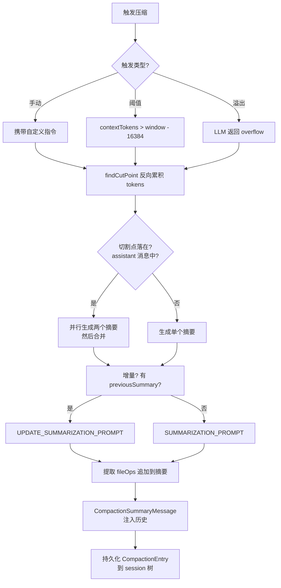
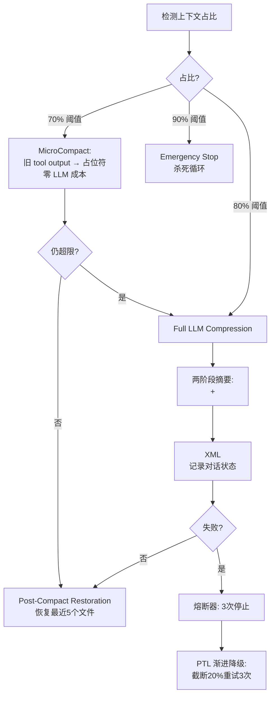

# /goal 与 /compact 跨框架调研报告

> **调研范围**: Pi (TypeScript)、Claude Code、OpenAI Codex CLI、DeepV Code (dvcode)
> **调研目标**: 理解各框架对上下文压缩（/compact）和目标导向（/goal）的实现方式，为 **pi-go** 提供借鉴建议
> **日期**: 2026-05-25

---

## 一、概述

Agent 在长时间对话中面临两大问题：

1. **上下文窗口溢出** — LLM 的上下文窗口有限（128K~200K tokens），对话越长越容易触发截断或性能下降
2. **目标漂移** — 在多轮交互中，Agent 容易遗忘初始意图或偏离任务

四个框架以不同方式解决这两个问题。本文档横向对比它们的实现，提炼最佳实践，为 pi-go（Go 重写版）给出具体采纳建议。

---

## 二、/compact（上下文压缩）

### 2.1 四框架对比总表

| 维度 | Pi (TypeScript) | Claude Code | Codex CLI (Rust) | DeepV Code |
|---|---|---|---|---|
| **触发动机** | 手动 + 阈值触发 + 溢出恢复 | 手动 + 自动(两步) | 手动 + Pre-turn + Mid-turn | 三层渐进式(70%/80%/90%) |
| **压缩算法** | LLM 摘要 + 增量更新 | LLM 摘要(每次全新) | LLM handoff + 保留用户消息(倒序) | MicroCompact + LLM 摘要 + Emergency stop |
| **摘要格式** | Goal / Progress / Decisions / Next Steps | 自由格式 | summary_prefix + 用户消息保留 | XML `<analysis>` + `<summary>` + `<state_snapshot>` |
| **切割策略** | `findCutPoint()` 反向累积 tokens | 先清旧 tool output，不够再摘要 | 保留预算(远程64K/本地逆序20K) | PTL 渐进降级(截断20%重试3次) |
| **Split Turn** | ✅ 并行生成两个摘要合并 | ❌ | ❌ | ❌ |
| **增量摘要** | ✅ previousSummary + UPDATE 提示 | ❌ 每次全新 | ❌ | ❌ |
| **文件追踪** | ✅ 从 toolCall 提取 read/modified 文件 | ❌ | ❌ | ✅ Post-Compact Restoration |
| **缓存友好** | ❌ | ✅ cache-safe forking | N/A | ✅ 压缩用低成本模型 |
| **扩展钩子** | session_before_compact / session_compact | ❌ | PreCompact / PostCompact | 熔断器(3次失败停止) |
| **微成本压缩** | ❌ | ❌ | ❌ | ✅ MicroCompact(零LLM) |

### 2.2 各框架压缩流程

#### Pi (TypeScript) 压缩流程



#### Claude Code 压缩流程

```mermaid
flowchart TD
    A[触发压缩] --> B{自动触发?}
    B -->|是| C[Step 1: 清理旧 tool output]
    C --> D{上下文仍超限?}
    D -->|是| E[Step 2: LLM 摘要]
    D -->|否| F[完成]
    B -->|手动| G[/compact [instructions]]
    G --> E
    E --> H[Cache-safe forking:\n共享对话前缀]
    H --> I[系统提示保留:\nCLAUDE.md + Memory]
    I --> J[清除 noSurviveCompact skill]
```

#### Codex CLI 压缩流程

```mermaid
flowchart TD
    A[触发压缩] --> B{触发阶段?}
    B -->|Pre-turn| C[turn 开始前检查]
    B -->|Mid-turn| D[tool call 循环中间检查]
    B -->|手动| E[/compact 命令]
    C --> F[选择后端]
    D --> F
    E --> F
    F --> G{后端类型?}
    G -->|本地 inline| H[LLM handoff summary\n+ 保留用户消息(逆序 ≤20K)]
    G -->|远程 V1| I[服务端压缩]
    G -->|远程 V2| J[加密压缩\n64K token 保留预算]
    H --> K[PreCompact/PostCompact hooks]
    I --> K
    J --> K
    K --> L[遥测记录:\ntrigger/reason/tokens]
```

#### DeepV Code 三层压缩流程



### 2.3 各框架核心设计洞察

| 框架 | 最大亮点 | 设计哲学 |
|---|---|---|
| **Pi** | Split turn + 增量摘要 + 文件追踪 | 精确语义压缩，不丢失上下文完整性 |
| **Claude Code** | Cache-safe forking + 两步自动 | 实用主义，优先零成本清理，再走 LLM |
| **Codex** | Mid-turn 压缩 + 远程加密 | 服务端优先，随时可压缩 |
| **DeepV** | MicroCompact + 三层渐进 + 文件恢复 | 零成本缓冲层 + 安全兜底 |

---

## 三、/goal（目标导向）

### 3.1 四框架对比总表

| 维度 | Pi (TypeScript) | Claude Code | Codex CLI (Rust) | DeepV Code |
|---|---|---|---|---|
| **有 /goal 命令?** | ❌ 无（仅有 goal 字段在摘要中） | ✅ | ✅（Extension） | ❌ 有 /plan 模式 |
| **存储方式** | 仅 compaction 摘要模板中的占位符 | session-scoped + Memory | 状态机 + tool 调用 | plan mode 内 |
| **系统提示注入** | ❌ | ✅ | ✅（通过 steering tool） | ✅ |
| **条件长度限制** | N/A | 4000 字符 | N/A（tool 参数） | N/A |
| **自动评估** | ❌ | ✅ Haiku 评估器，每次 turn 后检查 | ✅ continuation turn + 完成审计 | ❌ |
| **状态机** | ❌ | ❌ | ✅ Active→Paused/Complete/Blocked/BudgetLimited/UsageLimited | ❌ |
| **Token 预算** | ❌ | ❌ | ✅ 只计非缓存输入 + 输出 | ❌ |
| **跨 compaction 保留** | 在摘要模板中提及 | ✅ Memory 存储 | ✅ Extension 状态持久化 | plan 模式全局 |
| **完成审计** | ❌ | 条件检查 yes/no + reason | 逐条验证，阻塞需连续3次 | ❌ |

### 3.2 各框架 Goal 流程

#### Claude Code Goal 流程

```mermaid
flowchart TD
    A[/goal <condition>] --> B[创建 session-scoped Stop hook]
    B --> C[每个 turn 结束后]
    C --> D[Haiku 评估器检查]
    D --> E{条件满足?}
    E -->|Yes| F[停止 + 报告原因]
    E -->|No| G[继续 + 报告原因]
    F --> H[跨 compaction:\n存储在 Memory 中]
    G --> H
```

#### Codex CLI Goal 流程

```mermaid
flowchart TD
    A[/goal <objective>] --> B[Extension 创建 goal]
    B --> C[tool: create_goal]
    C --> D[状态机: Active]
    D --> E[每个 turn 自动检查]
    E --> F{完成?}
    F -->|Yes| G[tool: update_goal complete]
    F -->|No| H{阻塞?}
    H -->|Yes| I[tool: update_goal blocked\n连续3次]
    H -->|No| J[继续]
    G --> K[完成审计:\n逐条验证]
    I --> L[续接 continuation turn]
    K --> M{Token 预算超?\n非缓存输入+输出}
    M -->|Yes| N[BudgetLimited]
```

---

## 四、pi-go 借鉴建议

### 4.1 pi-go 当前状态

**/compact**（已完成核心流程，文件: `internal/compaction/` + `internal/session/` + `internal/agent/`）:

| 功能 | 状态 | 文件 |
|---|---|---|
| 设置/阈值判断 | ✅ `Settings` + `ShouldCompact` | `compaction.go:1-49` |
| Token 估算/切割 | ✅ `EstimateTokens` + `SplitMessages` | `estimate.go:1-132` |
| LLM 摘要 | ✅ `LLMSummarizer` | `summary.go:1-48` |
| 自定义摘要指令 | ✅ `customInstructions` 参数全链路传递 | `compaction.go` → `estimate.go` → `summary.go` |
| 自动触发 (maybeCompact) | ✅ 含持久化 compaction entry 到 session | `loop.go:193-241` |
| **手动 /compact 执行** | ✅ 调用 `AgentSession.Compact()` → `Agent.CompactNow()` 真正执行压缩 | `builtins.go` → `agent_session.go` → `agent.go` |
| Compaction 持久化 | ✅ `AppendCompaction()` + `BuildContext()` 识别压缩条目 | `session/session.go` |
| Leaf 指针持久化 | ✅ compaction entry 写入后 `SetLeaf()` 持久化 leaf 指针 | `session/session.go` |
| 增量摘要 | ❌ | — |
| 文件追踪 | ❌ | — |
| Split turn | ❌ | — |
| 扩展钩子 | ❌ | — |

**/goal**（基础版已完善，文件: `internal/runtime/` + `internal/slashcmd/`）:

| 功能 | 状态 | 文件 |
|---|---|---|
| Session 接口 | ✅ `Goal()` / `SetGoal()` / `ClearGoal()` | `context.go:26-28` |
| 内存存储 | ✅ `s.goal` string | `agent_session.go` |
| 系统提示注入 | ✅ `SetGoal`/`ClearGoal` 触发 agent 重建（同 `SwitchProfile` 模式） | `agent_session.go` |
| 跨 compaction 保留 | ❌ 摘要模板中未包含 Goal 字段 | — |
| 自动评估 | ❌ | — |
| Token 预算 | ❌ | — |

### 4.2 优先级规划

#### P0（必做）— 核心能力补齐

| # | 改进项 | 状态 | 说明 |
|---|---|---|---|
| 1 | **手动 /compact 执行** | ✅ 已完成 | `builtins.go` → `AgentSession.Compact()` → `Agent.CompactNow()` 完整链路 |
| 2 | **文件操作追踪** | ❌ 待做 | 从 assistant 消息的 toolCall 参数中提取 readFiles/modifiedFiles，追加到摘要末尾 |
| 3 | **增量摘要更新** | ❌ 待做 | 在 `SummarizePrompt` 中支持传入 `previousSummary`，使用增量提示而非每次都重新摘要 |
| 4 | **溢出恢复** | ❌ 待做 | 在 `loop.go` 的 `processTurn` 中检测 LLM 返回的 overflow error，主动触发压缩 |
| 5 | **Goal 注入确认** | ✅ 已完成 | `SetGoal`/`ClearGoal` 已通过 agent 重建注入 system prompt |

#### P1（推荐）— 体验优化

| # | 改进项 | 具体做法 | 涉及文件 |
|---|---|---|---|
| 6 | **MicroCompact** | 新增 `micro_compact.go`：将旧 tool output 替换为占位符 `[tool result trimmed: N chars]`，零 LLM 调用 | `internal/compaction/micro_compact.go` **新文件** |
| 7 | **Post-Compact File Restoration** | 新增 `restoration.go`：压缩后重新读取最近修改的 3-5 个文件注入上下文 | `internal/compaction/restoration.go` **新文件** |
| 8 | **PreCompact/PostCompact 钩子** | 参照 Codex 和 Pi，在 `extensions/types.go` 中增加生命周期钩子接口 | `internal/extensions/types.go`、`internal/agent/loop.go` |
| 9 | **Split Turn 处理** | 当切割点落在 assistant 消息中时，生成两个摘要再合并 | `internal/compaction/estimate.go` 的 `SplitMessages` |
| 10 | **Goal 摘要保留** | 在压缩摘要模板中包含 Goal 字段，确保跨压缩后 goal 不丢失 | `internal/compaction/summary.go` 的提示模板 |
| 11 | **Haiku 小模型评估器** | 参照 Claude Code，用低成本模型每次 turn 后检查 goal 完成条件 | `internal/agent/goal_evaluator.go` **新文件** |

#### P2（锦上添花）— 进阶能力

| # | 改进项 | 具体做法 | 涉及文件 |
|---|---|---|---|
| 12 | **熔断器 + PTL 降级** | 压缩失败 3 次后停止自动压缩，每次重试截断 20% 历史 | `internal/compaction/circuit_breaker.go` **新文件** |
| 13 | **Mid-turn compaction** | 在 `executeToolCalls` 循环中间检查上下文占比 | `internal/agent/loop.go` |
| 14 | **Codex 式 Goal 状态机** | 引入 Active→Paused/Complete/Blocked 状态管理 | `internal/agent/goal.go` **新文件** |
| 15 | **Goal Token 预算** | 只计非缓存输入 + 输出 token，预算超限自动暂停 | `internal/agent/goal.go` |
| 16 | **完成审计 + 自动续接** | 每次 turn 后逐条验证 goal 完成，阻塞连续 3 次自动续接 | `internal/agent/goal_evaluator.go` |

### 4.3 建议采纳路线图

```
Phase 1 (已完成 ✅)
├── ✅ P0-1: /compact 手动执行 + 持久化
├── ✅ P0-5: Goal 注入确认 + SetGoal/ClearGoal 重建 agent
├── ✅ 自动压缩持久化（maybeCompact 写 compaction entry）
└── ✅ 自定义摘要指令（/compact <text> → customInstructions 全链路）

Phase 2 (下个 sprint)
├── P0-4: 溢出恢复 → 0.5 天
├── P1-10: Goal 摘要保留 → 0.5 天
├── P1-6: MicroCompact → 1 天
└── P0-2: 文件追踪 → 1 天

Phase 3 (后续)
├── P0-3: 增量摘要 → 1 天
├── P1-7: File Restoration → 1 天
├── P1-8: 扩展钩子 → 1 天
├── P1-9: Split Turn → 1 天
└── P1-11: Haiku 评估器 → 2 天

Phase 4 (远期)
├── P2-12: 熔断器 + PTL → 1 天
├── P2-13: Mid-turn → 1 天
└── P2-14~16: Goal 状态机 → 3 天
```

### 4.4 关键设计决策建议

| 决策点 | 建议 | 理由 |
|---|---|---|
| Compaction 持久化方式 | ✅ **已采纳：EntryTypeCompaction + position-based 截断** | 不需要 FirstKeptEntryID 映射，BuildContext 遇到 compaction entry 即跳过之前的旧消息，简洁可靠 |
| 自定义摘要指令 | ✅ **已采纳：customInstructions 全链路传递** | `/compact <text>` → `SummarizePrompt()` 接受 customInstructions 参数，LLM 生成摘要时可参考用户指令 |
| Agent 重建模式 | ✅ **已采纳：SetGoal/ClearGoal 触发 buildAgent** | 与 SwitchProfile 一致，操作改变 system prompt 后必须重建 agent |
| 增量 vs 全新摘要 | **增量**（Pi 方式） | 减少 LLM 调用次数，且长对话效果更稳定 |
| MicroCompact 先于 LLM 压缩 | **是**（DeepV 方式） | 零成本清理 tool output 即可解决大部分超限场景 |
| 压缩成本模型 | **cache 共享**（CC 方式）+ **低成本模型**（DeepV 方式） | 减少主模型 token 消耗 |
| Goal 状态机复杂度 | **先简单后复杂** | Phase 1 只做注入 + 重建，Phase 2/3 逐步加评估和状态管理 |
| 三层渐进 vs 单层 | **三层渐进**（DeepV 方式） | MicroCompact → LLM 摘要 → Emergency Stop，安全且高效 |

---

## 五、总结

四个框架对 /compact 和 /goal 的实现各有侧重：

- **Pi (TypeScript)** 的压缩最精确（split turn、增量、文件追踪），但无 goal 系统
- **Claude Code** 最实用（cache-safe forking、两步自动、Haiku 评估器）
- **Codex CLI** 最工程化（远程加密、Mid-turn、Goal 状态机、遥测）
- **DeepV Code** 最安全（三层渐进、MicroCompact、熔断器、PTL）

pi-go 作为 Go 重写版，采取 **P0 补齐核心 → P1 体验优化 → P2 进阶能力** 的渐进式路线。Phase 1（核心压缩 + Goal 注入）已完成，当前重点转向 Phase 2（溢出恢复、MicroCompact、文件追踪等体验优化），再逐步引入增量摘要、状态机和审计等高级功能。
